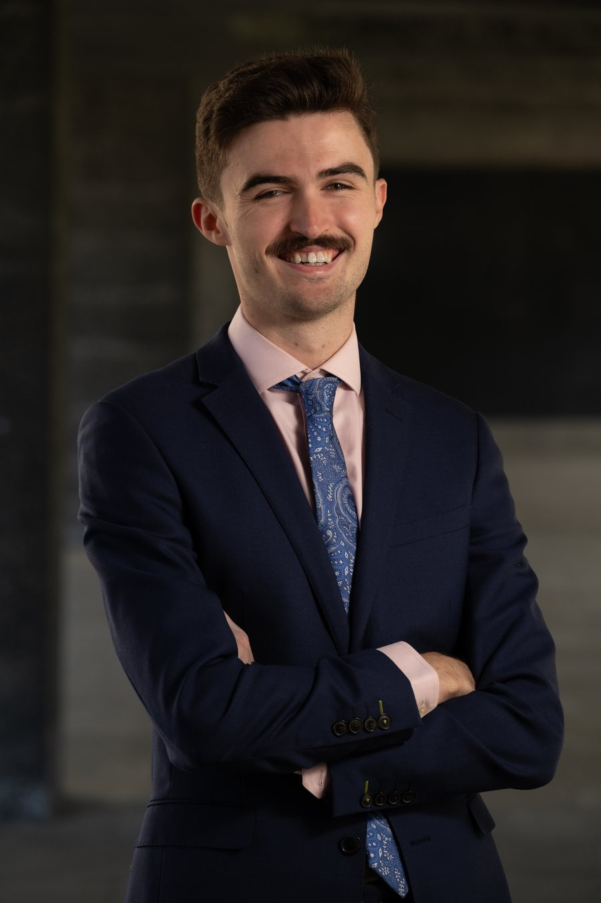

# Fergus McCormack

PhD Candidate in Economics University of Cambridge

I am on the <strong>2026–27 academic job market</strong>.

<a class="btn btn-primary" href="papers/McCormack_JMP_The_Depression_Trap.pdf">Job Market Paper (PDF)</a> <a class="btn" href="papers/McCormack_CV.pdf">Curriculum Vitae (PDF)</a>

<a href="mailto:fm527@cam.ac.uk">fm527@cam.ac.uk</a> &middot; Faculty of Economics, University of Cambridge

## About

I am a PhD candidate in Economics at the [University of Cambridge](https://www.econ.cam.ac.uk/), supervised by [Eric French](https://www.econ.cam.ac.uk/people/academic/eric-french) and advised by [Weilong Zhang](https://www.econ.cam.ac.uk/people/academic/weilong-zhang). My research lies at the intersection of **health economics**, **labor economics**, and **genoeconomics**. I study how genetic risk for mental illness shapes labor supply, health, and treatment decisions over the life cycle, and what this implies for the design of mental health policy.

My work combines structural life-cycle models with panel data methods and Mendelian randomization, drawing on UK household panel data (Understanding Society), the UK Biobank, and Norwegian administrative data linked to molecular genetic information.

Before my PhD, I completed the MPhil in Economic Research at Cambridge and an MA in Economics at the University of Edinburgh, and I worked as a trainee at the European Central Bank. In autumn 2025 I was a visiting researcher at the University of Oslo, hosted by Eivind Ystrøm.

## Job Market Paper

### [The “Depression Trap”: Genetic Risk, Labor Supply, and the Case for Precision Psychiatry](papers/McCormack_JMP_The_Depression_Trap.pdf)

with Qianyu Yang &middot; <a href="papers/McCormack_JMP_The_Depression_Trap.pdf">Download PDF</a>

We analyze how genetic risk for depression influences the joint dynamics of labor supply, health, and treatment decisions using a life-cycle model and longitudinal data. We find that a one standard deviation increase in genetic risk for depression substantially reduces earnings and employment and worsens health. We identify the “depression trap”, a self-reinforcing cycle of depression and non-employment, as the central mechanism linking genetic risk to persistent labor market exit. As publicly funded psychotherapy is free at the point of use and supply-constrained, we evaluate prioritizing access to high-risk individuals, and find that this raises employment and lowers severe depression, resulting in a net fiscal surplus. We also simulate the economic and health consequences associated with recent declines in mental health and explore potential policy solutions.

Working papers and work in progress are listed on the [Research](research) page.

## References

<strong><a href="https://www.econ.cam.ac.uk/people/academic/eric-french">Eric French</a></strong> Montague Burton Professor of Industrial Relations and Labour Economics University of Cambridge

<strong><a href="https://www.econ.cam.ac.uk/people/academic/weilong-zhang">Weilong Zhang</a></strong> Associate Professor of Economics University of Cambridge

<strong><a href="https://www.econ.cam.ac.uk/people/academic/kai-liu">Kai Liu</a></strong> Professor of Economics University of Cambridge

Contact details for my references are given in my [CV](cv).

## Contact

Fergus McCormack 
Faculty of Economics, University of Cambridge 
Darwin College, Cambridge CB3 9EU, United Kingdom 
Email: [fm527@cam.ac.uk](mailto:fm527@cam.ac.uk)
